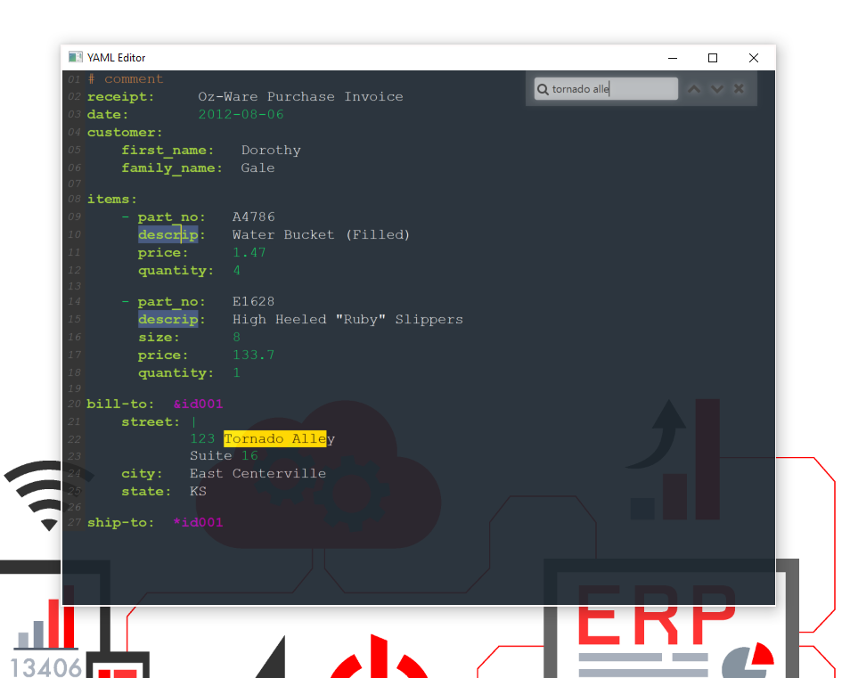

# scalafx-yaml-editor
This is a ScalaFX demo that contains an simple YAML editor with syntax highlighting and a search function.
<br />




<br />
<br />

## Run Project
<br />

```
cd scalafx-yaml-editor
sbt run
```
<br />


## Dependencies
<br />

ScalaFX<br />
https://github.com/scalafx/scalafx

<br />

RichTextFX<br />
https://github.com/TomasMikula/RichTextFX